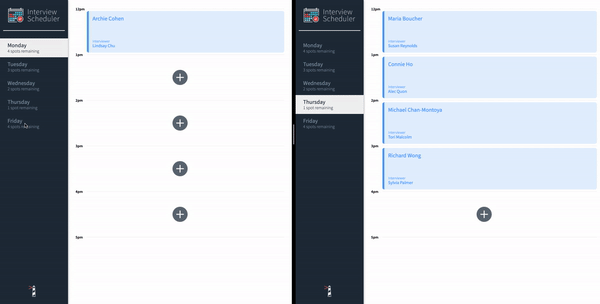

# Interview Scheduler

Interview Scheduler is React-based scheduling app that allows multiple users at once to create, edit and delete appointments with mentors.

Visit the site hosted [here](https://scheduler-ch.netlify.app/).

## Final Product

## Features
* Multi-user interaction
* Create a new appointment
* Edit an existing appointment
* Delete an existing appointment with confirmation prior

## Getting Started
* Install all dependencies with `npm install`
* Run the local server with `npm start`

## Dependencies
* axios
* classnames
* node-sass
* normalize.css
* react
* react-dom
* react-scripts

